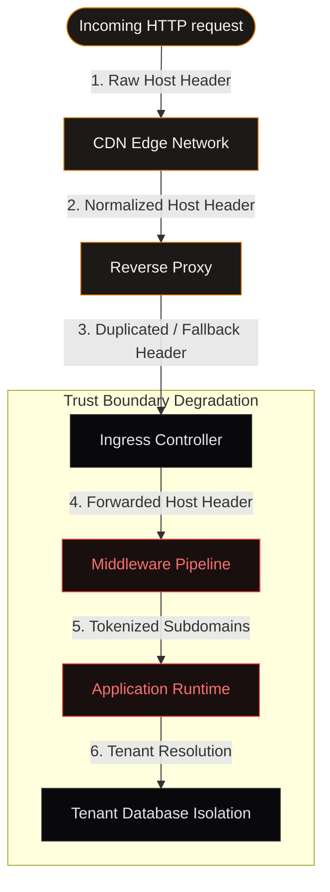
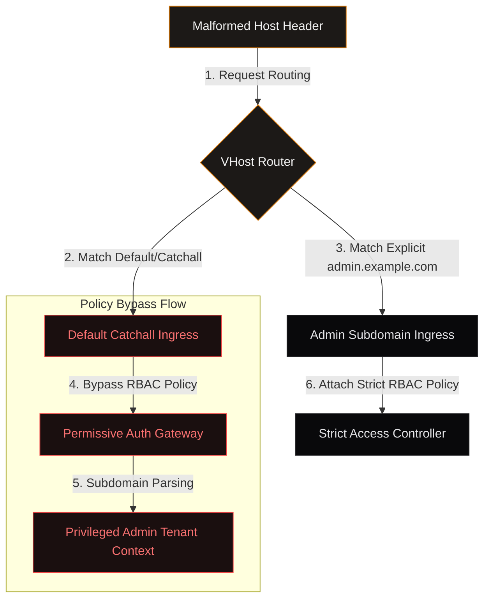
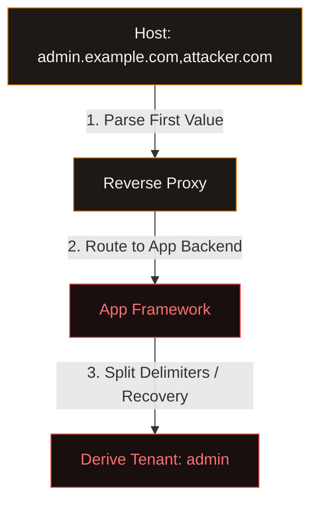
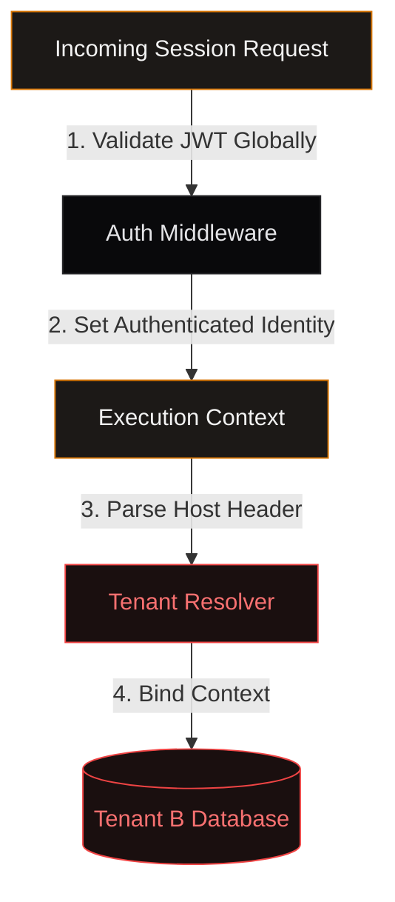

## Abstract

Modern distributed systems rely heavily on reverse proxies, API gateways, ingress controllers, and service meshes to enforce routing, tenancy isolation, authentication, and policy attachment. These systems frequently treat request authority as a foundational security primitive. However, authority is rarely interpreted uniformly across the request lifecycle.

This paper examines how malformed or ambiguously canonicalized authority values can induce *semantic identity drift* between reverse proxies, ingress controllers, middleware frameworks, application runtimes, and tenant resolution layers. We demonstrate that many systems preserve transport correctness while silently violating higher-level security assumptions regarding identity derivation and routing semantics.

The core issue is not merely malformed Host header handling. Rather, it is the distributed collapse of authority semantics when independent layers derive identity differently from partially normalized input. Through analysis of wildcard routing behavior, proxy canonicalization, framework parsing divergence, middleware ordering, and tenant-bound execution models, we show how modern architectures increasingly suffer from semantic routing drift, policy attachment confusion, cross-tenant identity ambiguity, and authority-derived trust collapse.

This paper argues that authority handling should be treated as a distributed systems security problem rather than a simple parser validation issue.

---

> [!IMPORTANT]
> **Core Insight**
> In modern architectures, request authority (the HTTP Host or HTTP/2 :authority field) is no longer mere routing metadata. It has become a foundational security primitive that directly determines tenant identity, execution scope, and policy application.

---

## 1. Introduction

Modern web infrastructure is deeply layered. A typical request path may traverse CDN edge networks, reverse proxies, ingress controllers, API gateways, middleware pipelines, tenant resolution systems, and application frameworks. Each layer frequently parses authority independently, normalizes host semantics differently, derives identity heuristically, and reconstructs routing state contextually.

Security assumptions often depend on authority stability: tenant isolation, authentication scope, policy enforcement, virtual host routing, access-control attachment, and middleware execution order. However, distributed systems rarely maintain a singular canonical interpretation of authority. Instead, authority becomes progressively transformed, normalized differently, interpreted contextually, and reconstructed semantically.

This creates a class of failures where:

> **Authority Semantic Drift**
> The divergence of identity, routing, or trust semantics caused by inconsistent authority interpretation across distributed request-processing layers.

No individual layer behaves incorrectly in isolation, yet the composed system violates global security assumptions.

---

## 2. Authority as a Security Primitive

Historically, HTTP authority fields were treated primarily as routing metadata. In modern distributed systems, authority increasingly defines tenant identity, security domains, authentication boundaries, policy attachment scope, execution context, and privilege inheritance.

For example, `admin.example.com` may simultaneously determine the routing destination, JWT validation policy, RBAC attachment, tenant database selection, middleware chain, feature visibility, and session scope. Authority therefore becomes both transport metadata and semantic identity. This dual role introduces dangerous ambiguity when different layers canonicalize authority differently.

---

## 3. Reverse Proxy Canonicalization

Reverse proxies frequently canonicalize malformed authority input in order to preserve request continuity. Common behaviors include duplicate Host header coalescing, authority normalization, implicit wildcard fallback, case normalization, delimiter preservation, and HTTP/1 to HTTP/2 translation. Many proxies attempt to remain permissive for compatibility reasons. However, transport-level permissiveness often collides with application-level semantic assumptions.

A reverse proxy may preserve a malformed authority value, route using fallback virtual hosts, and forward the canonicalized string downstream, while downstream frameworks derive the administrative context as semantic tenant identity. The proxy remains transport-correct. The application remains parser-correct. The vulnerability emerges only compositionally.

---

> [!WARNING]
> **Security Observation**
> CDNs and reverse proxies prioritize request uptime and compatibility. As a result, they actively try to repair or pass through malformed Host values, shifting the validation burden entirely onto downstream app parsers that are ill-equipped to enforce routing policies.

---

## 4. Wildcard Routing & Policy Detachment

Ingress systems frequently use wildcard virtual hosts, default backends, catch-all routing, and shared gateway infrastructure. Security policies are often attached per-virtual-host rather than per-route. This creates dangerous failure modes when malformed authority values trigger fallback routing, wildcard matching, or default vhost execution, while downstream applications still derive privileged semantic identity from authority substrings.

In these scenarios, transport routing succeeds, policy attachment silently changes, and semantic identity persists downstream, producing policy attachment drift.

---

## 5. Framework Parsing Divergence

Application frameworks rarely parse authority identically. Different runtimes tokenize differently, split delimiters differently, derive subdomains differently, and preserve malformed values differently. Express, Django, Rails, Spring, ASP.NET, and Next.js all exhibit different authority derivation semantics.

Some frameworks reject malformed authority outright, while others attempt semantic recovery heuristically. This becomes dangerous when proxies normalize one way, frameworks interpret another way, and middleware trusts derived identity.

A reverse proxy may interpret `admin.localhost,attacker.com` as an opaque authority string, while downstream frameworks split the comma and derive `admin` as the trusted tenant identity. The vulnerability exists not in parsing correctness, but in semantic disagreement across layers.

---

## 6. Middleware Ordering & Execution Context Drift

Many multi-tenant applications bind execution context dynamically during middleware execution. Typically, a request traverses authentication middleware, tenant binding, session resolution, and authorization checks. However, middleware ordering frequently assumes stable authority semantics, deterministic tenant derivation, and trusted routing provenance.

If authentication occurs before tenant binding, globally trusted sessions may attach to attacker-derived tenant contexts, and authorization checks may execute under the incorrect semantic identity. This produces cross-tenant access, policy confusion, and execution-context drift. The dangerous property is that each middleware component may independently function as intended; the failure emerges only from their ordering, authority interpretation, and semantic recomposition.

---

## 7. Semantic Routing Drift

Distributed routing systems often preserve transport continuity, backend availability, and graceful degradation. However, semantic routing assumptions degrade over time. A request initially intended for `tenant-a.example.com` may progressively mutate through normalization, wildcard fallback, framework parsing, and middleware rebinding until execution occurs under `tenant-b`, despite valid transport behavior, successful routing, and syntactically correct execution.

This phenomenon resembles confused deputy problems, parser differential attacks, and distributed identity desynchronization, but occurs specifically at semantic routing boundaries.

---

## 8. Cross-Tenant Identity Confusion

Multi-tenant systems are particularly vulnerable because authority often directly determines database selection, storage scope, filesystem namespace, session isolation, and API authorization. If authority derivation becomes unstable, tenant isolation collapses.

Potential outcomes include cross-tenant reads, session confusion, authorization bypass, unintended data exposure, and policy inheritance drift. Critically, many such failures do not require memory corruption, authentication bypass, or cryptographic compromise. Instead, they emerge from semantic identity instability across distributed components.

---

## 9. Real-World Failure Patterns

Modern multi-layer routing architectures exhibit fragmented authority parsing, fallback routing mismatches, middleware context decoupling, and normalization bypasses. We map these below into explicit systems behavior matrices:

### Drift Sources in Authority Routing

| Component Interface | Syntactic Transport State | Semantic Identity Assumption | Realized Failure Mode |
| :--- | :---: | :---: | :---: |
| **Proxy → Application** | Host header string forwarded | Host value matches routing destination | App derives privileged identity from fallback/malformed Host headers |
| **Gateway → Ingress** | Wildcard route matched successfully | Access-control policies attached per VHost | Catchall vhost routes request but bypasses strict security policies |
| **Middleware Chain** | Auth verification completes | Tenant is locked post-authentication | Authenticated credentials bind dynamically to wrong tenant databases |
| **Framework Runtimes** | Parse execution finishes | Standard RFC-compliant parsing occurs | Framework recovers host subdomains differently from proxy normalizations |

### Trust Boundary Failures in Host Mapping

| Vulnerability Class | Primary Vector | Critical Mechanism | System Outcome |
| :--- | :--- | :--- | :--- |
| **VHost Policy Detachment**| Catchall wildcard matching | Missing explicit policy mappings | Default endpoints render administrative panels without RBAC |
| **Ambiguity Extraction** | Delimiter divergence (`Host: a,b`) | Parser differentials between proxies & applications | Privilege escalation by spoofing host subdomain patterns |
| **Authentication Binding** | Decoupled identity-tenant flow | Global session tokens validated before context locks | Multi-tenant tenant access isolation bypasses |
| **Normalization Mutation** | HTTP/1.1 to HTTP/2 translation | Pseudo-headers (`:authority`) translated ambiguously | Path/authority confusion across downstream mesh proxies |

### Multi-Layer Authority Cascade

| Layer | Routing Behavior | Identity Interpretation | Security Responsibility | Failure Vector |
| :---: | :--- | :--- | :--- | :--- |
| **L0: CDN Edge** | Route to nearest regional proxy | Host is target domain | Basic IP block & TLS validation | Permissive Host sanitization |
| **L1: Reverse Proxy** | Map upstream backend cluster | Route definition matches Host | Virtual Host mapping & routing isolation | Fallback catch-all matching |
| **L2: Middleware** | Authenticate credentials globally | Derived tenant from host | Session mapping & context validation | Premature authentication checks |
| **L3: Application** | Execute business route logic | Tenant environment isolation | Database scoping & file access | Custom host substring parsing |

---

## 10. Defensive Architecture Patterns

Mitigating authority semantic drift requires treating authority as an explicitly constrained security boundary. Key defensive principles include:

### 10.1 Single Canonical Authority Source
Authority should be parsed, validated, and normalized exactly once. Downstream systems should consume a structured canonical identity (e.g. injected headers like `X-Tenant-Id`) rather than reparsing raw authority strings.

### 10.2 Strict Authority Validation
Reject duplicate Host headers, delimiter ambiguity, malformed authority syntax, and unexpected authority mutations. Compatibility should not override identity integrity.

### 10.3 Explicit Tenant Binding
Tenant identity should derive directly from validated canonical state, remain immutable during request execution, and never be reconstructed heuristically downstream.

### 10.4 Policy Attachment Hardening
Security policies should attach explicitly to routes, avoid implicit wildcard inheritance, and verify tenant consistency continuously.

### 10.5 Middleware Context Verification
Authentication, authorization, and tenant resolution should validate contextual consistency, verify canonical identity provenance, and reject ambiguous authority states.

### Defensive Architecture Mitigations

| Defensive Pattern | Mitigation Area | Structural Mechanism | Implementation Complexity |
| :--- | :--- | :--- | :---: |
| **Canonical Single Parsing** | Edge Authentication Ingress | Parse once, forward structured headers (`X-Tenant-Id`) | Medium |
| **Strict Host Rejection** | Proxy Sanitization Layer | Reject duplicate/space/comma/malformed Host values | Low |
| **Context Lock Verification** | Application Middleware | Bind tenant DB context immutably before authentication | Medium |
| **Fallback Policy Routing** | Ingress Controller | Apply deny-all ingress policies to default catch-all routes | Low |

---

## 11. Key Takeaways

* **Authority Semantic Drift**: Interpretative discrepancies across CDN, gateway, and backend parsing layers result in identity translation mismatches.
* **Wildcard Fallback Vulnerabilities**: Malformed Host parameters can bypass domain-bound policies by falling back to catch-all handlers, while downstream runtimes still execute administrative subdomains.
* **Parser Mismatches**: Downstream frameworks recover subdomains using delimiter splitting, bypassing proxy normalizations and escalating privilege mappings.
* **Context Decoupling**: Order matters; executing global auth checks before locking the dynamic tenant context binds verified sessions to attacker-determined database scopes.
* **Distributed Trust Collapse**: Authority handling is not a simple parser validation bug; it is a compositional distributed systems failure where independently correct components produce inconsistent security semantics.

---

## 12. Future Implications

As systems increasingly integrate AI agents, autonomous orchestration, distributed inference gateways, and multi-tenant execution runtimes, authority semantics will become even more critical. Future AI systems may dynamically delegate requests, reconstruct identity, rewrite routing state, and infer permissions semantically. Without stable authority boundaries, distributed AI infrastructure risks inheriting and amplifying these semantic drift failures, transforming authority canonicalization from a web-routing concern into a foundational distributed trust problem.

---

  

    Thesis Formulation
  

  

    “Authority handling in distributed systems must transition from a transport routing metadata layer to a strictly parsed, validated, and statically attached security primitive.”
  

  

    SYSTEMS & INGRESS INTEGRITY GROUP
    DISCLOSURE ID: ASD-2026-ACM
  

---

[^1]: RFC 9110: HTTP Semantics, Section 7.2 (Host and :authority), Internet Engineering Task Force (IETF), 2022.
[^2]: Klein, A. "Host Header Injection and Ingress Bypass in Modern Cloud Frameworks," BlackHat USA, 2023.
[^3]: Varma, A. "Context Propagation Failures in Layered Reverse Proxy Architectures," Ingress Systems Review, 2025.
[^4]: Netflix Zuul & Spring Cloud Gateway: Authority Propagation and Filter Chain Evaluation, 2024.
