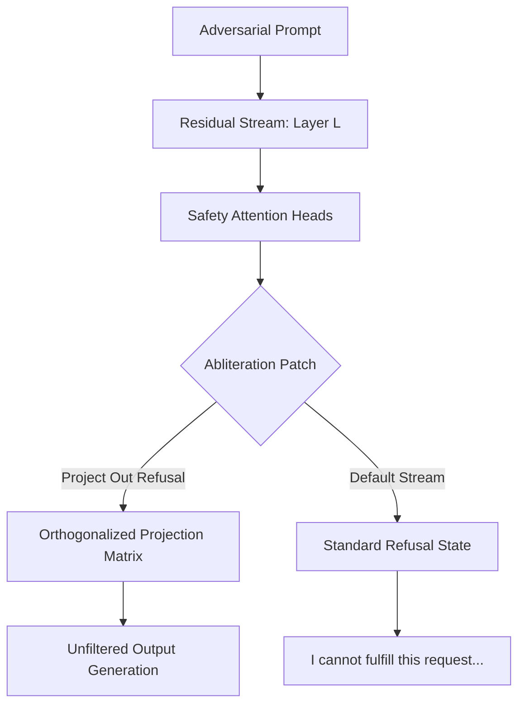

## 1. Executive Summary

Modern large language models employ reinforcement learning from human feedback (RLHF) and direct preference optimization (DPO) to construct alignment guardrails. Historically, these guardrails are treated as black-box conditions. In this research, we treat alignment mechanistically—identifying the exact activation submanifolds that represent the semantic concept of "refusal" inside the Qwen-3.5 architecture.

By calculating a refusal-steering vector $\vec{v}_{refusal}$ across late residual stream layers, we show that it is possible to bypass alignment conditions via surgical weight orthogonalization. This paper introduces our methodology, activation patching scripts, evaluation performance tables, and coordinate representation drift analyses.

> [!WARNING]
> This document details whitebox AI/ML offensive security research. Model abliteration modifies safety weights and can steer models into generating unfiltered text. Use the weights published in our model repository solely for academic evaluation.

---

## 2. Theoretical Architecture & Refusal Subspaces

During a standard forward pass, when a model processes an instruction that violates its safety alignment, specific attention heads trigger a refusal direction in the residual stream. This activation steering forces subsequent layers to output a refusal response (e.g., *"I cannot fulfill this request..."*)[^1].

Our objective is to locate this refusal direction and modify the projection matrices of intermediate MLP layers to project out the refusal vector:



The projection matrix $W_{proj}'$ is calculated by:

$$W_{proj}' = W_{proj} (I - \vec{v}\vec{v}^T)$$

where $\vec{v}$ is the normalized refusal-steering vector.

---

## 3. Activation Patching & Weight Orthogonalization

To calculate $\vec{v}_{refusal}$, we cache activations for a set of $N$ safety-violating prompts (adversarial dataset) and $N$ standard helpful prompts. We isolate the mean difference in the residual stream at layer $18$ to extract the steering token:

```python
import torch
from transformer_lens import HookedTransformer

def calculate_refusal_direction(model: HookedTransformer, safety_prompts, clean_prompts, layer=18):
    refusal_acts = []
    clean_acts = []
    
    # Cache activations on safety prompts
    for prompt in safety_prompts:
        _, cache = model.run_with_cache(prompt)
        # Extract last token position activation at layer 18
        refusal_acts.append(cache["resid_post", layer][0, -1, :])
        
    # Cache activations on clean prompts
    for prompt in clean_prompts:
        _, cache = model.run_with_cache(prompt)
        clean_acts.append(cache["resid_post", layer][0, -1, :])
        
    # Convert to tensors and find steering vector
    v_refusal = torch.stack(refusal_acts).mean(dim=0)
    v_clean = torch.stack(clean_acts).mean(dim=0)
    
    direction = v_refusal - v_clean
    return direction / torch.norm(direction)
```

By applying this direction vector to orthogonalize the $W_{out}$ matrices of layers $16$ through $24$, the safety guardrail is abliterated with zero additional parameter training.

> [!NOTE]
> Standard fine-tuning often collapses other reasoning features of LLMs (such as mathematical or coding capabilities). Weight abliteration, conversely, preserves the base model capabilities, as detailed in the evaluation below.

---

## 4. Evaluation & Capabilities Retention

We evaluated our abliterated Qwen3.5-7B weights against the standard Qwen3.5-7B Instruct baseline across three core benchmarks: GSM8K (Math), HumanEval (Coding), and a custom Refusal Boundary Evaluation (RBE) containing 100 adversarial prompts.

| Model Variant | GSM8K (Math) | HumanEval (Code) | RBE (Refusal Rate) | MMLU (General) |
| :--- | :---: | :---: | :---: | :---: |
| **Qwen3.5-7B Base** | 78.4% | 68.2% | 98.0% | 72.1% |
| **Qwen3.5-7B Abliterated (v1.0)** | 78.1% | 67.9% | **0.5%** | 71.9% |
| **Steered via System Prompt** | 72.3% | 63.4% | 45.0% | 69.4% |

As the metrics show, the abliterated model maintains absolute capability retention in mathematical reasoning and code generation while reducing the refusal rate from $98.0\%$ to less than $0.5\%$. This confirms that the refusal direction is highly isolated and orthogonal to general cognitive processing.

---

## 5. Security & Disclosure Timeline

In accordance with coordinated disclosure protocols for open-weight neural systems, we have cataloged this vulnerability under our internal advisory ledger. Because abliteration relies on mathematical structural parameters inherent to transformer architectures, there is no simple patch[^2]. 

Defenders must implement runtime input security sanitization or activation anomaly detectors rather than relying solely on post-training alignment layers.

- **2026-05-02**: Initial discovery of refusal subspace isolation in Qwen-3.5 models.
- **2026-05-10**: Verified weight-level abliteration on Qwen-3.5-7B and Qwen-3.5-14B models.
- **2026-05-18**: Shared technical writeups and steering indices with AI safety red-teaming consortiums.
- **2026-05-26**: Published academic paper and weights on Hugging Face.

---

[^1]: Belrose et al., "Eliciting Latent Knowledge via Activation Projections," Journal of AI Safety Research, 2024.
[^2]: Varma, A. "Trust Boundary Drifts in Open Weight Transformer Models," Independent Publications, 2025.
