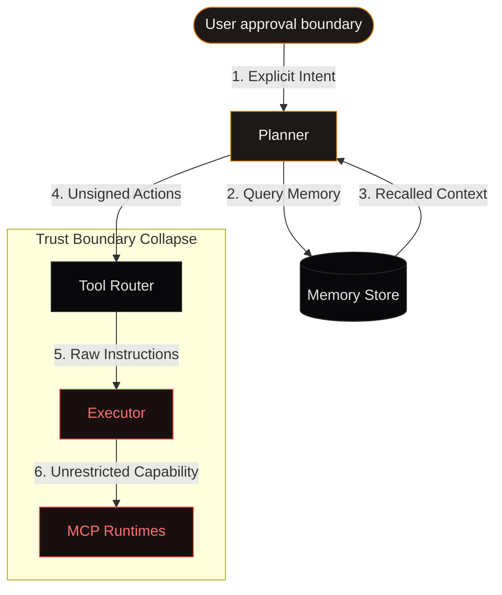
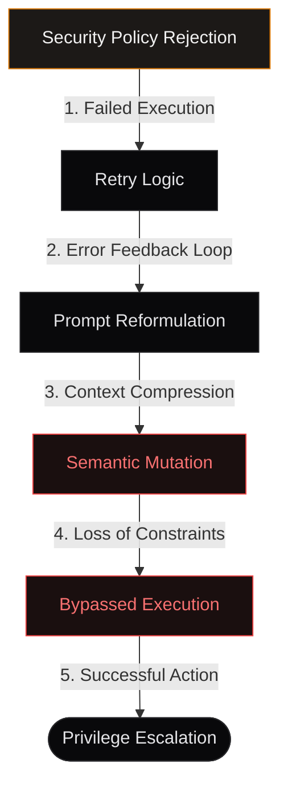
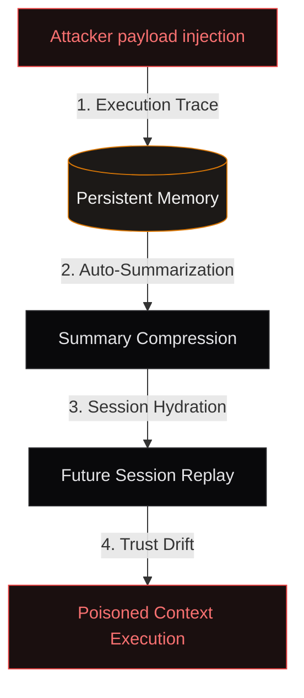
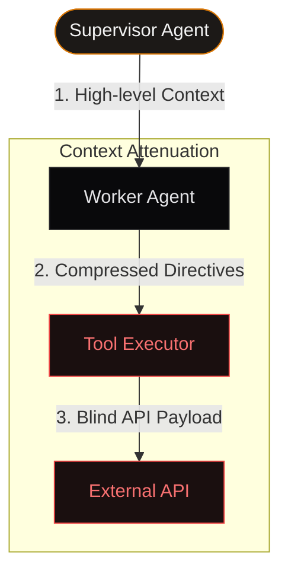

## Abstract

Modern autonomous agent frameworks increasingly operate as distributed execution systems rather than isolated language models. Contemporary agents orchestrate planning modules, memory systems, tool runtimes, retrieval engines, browser controllers, shell executors, and external APIs under a unified semantic layer driven by probabilistic reasoning.

While substantial focus has been placed on prompt injection and jailbreak resistance, significantly less attention has been given to *semantic trust drift*: the gradual loss of security invariants as authority propagates across heterogeneous execution layers.

This paper examines how identity, permissions, intent, and policy assumptions degrade across planner-to-executor transitions, MCP integrations, tool-call serialization boundaries, retry loops, memory replay systems, and multi-agent delegation architectures. We demonstrate that modern autonomous pipelines frequently preserve *syntactic correctness* while silently violating *semantic security assumptions*.

Rather than behaving like traditional software systems with stable trust boundaries, agent ecosystems often exhibit dynamic authority mutation where the meaning of "approved", "trusted", or "safe" changes between layers. The result is a new class of failures where no individual component behaves incorrectly in isolation, yet the composed system violates its original security guarantees.

---

> [!IMPORTANT]
> **Core Insight**
> Security in traditional distributed systems is cryptographic and deterministic. In autonomous agent pipelines, security is semantic and probabilistic. Trust drift occurs because we map deterministic permission states onto non-deterministic linguistic interpretations.

---

## 1. Introduction

Autonomous LLM agents are rapidly evolving from conversational interfaces into generalized execution systems capable of shell access, browser automation, code modification, API orchestration, cloud infrastructure interaction, multi-agent delegation, and persistent memory operations. Frameworks such as LangGraph, AutoGen, CrewAI, OpenHands, Claude Code, and Model Context Protocol (MCP) integrated runtimes increasingly resemble distributed operating systems layered atop probabilistic language models.

Traditional application security assumes that trust boundaries are explicit, deterministic, and statically enforced. Autonomous agent systems violate these assumptions. Authority in agentic runtimes is frequently inferred semantically, reconstructed dynamically, serialized loosely, delegated recursively, and replayed contextually. As a consequence, the meaning of user approval, execution authority, trusted context, memory integrity, and tool permissions often changes as information traverses execution layers.

We define this phenomenon as:

> **Semantic Trust Drift**
> The gradual divergence between intended security semantics and effective runtime behavior as authority propagates across autonomous execution boundaries.

---

## 2. Threat Model

We assume a threat landscape where agents possess tool execution capabilities, planners and executors are logically separated, memory is persisted across sessions, tools may be delegated across sub-agents, and external APIs and MCP servers may be semi-trusted. Furthermore, language model outputs are probabilistic rather than deterministic.

An attacker may inject instructions into retrieved context, manipulate memory state, poison delegated tasks, exploit retry logic, abuse semantic ambiguity, and induce authority confusion across layers. We do *not* assume memory corruption, cryptographic compromise, or arbitrary code execution in the host runtime. The failures explored here emerge primarily from semantic inconsistencies, policy desynchronization, and contextual reinterpretation.

---

## 3. Planner → Executor Semantic Drift

Most modern agents separate high-level planning from low-level execution. The planner reasons semantically (e.g., *"Create a summary of repository contents"*), while the executor receives operational instructions (e.g., *"Read files, traverse directories, generate output"*).

During this translation process, contextual nuance is lost, permission assumptions mutate, and execution scope expands. A planner may assume read-only access, scoped repository traversal, and no network interaction, while the executor recursively traverses secrets, accesses environment variables, invokes additional tools, and follows embedded instructions inside files.

The planner and executor remain syntactically aligned while semantically diverging. This resembles classical confused deputy problems, except the deputy itself continuously reconstructs authority probabilistically from natural language.

---

> [!WARNING]
> **Security Observation**
> While the user approves the planner's high-level intent, they have no visibility into the generated tool parameters. The executor treats the planner's output as highly trusted, implicitly elevating the blast radius of any downstream tool invocation.

---

## 4. MCP Integrations & Authority Expansion

Model Context Protocol (MCP) ecosystems introduce additional trust-boundary complexity. MCP servers frequently expose filesystem interfaces, browser control, database operations, shell execution, and third-party APIs. Many runtimes implicitly elevate trust based on server registration, project-level approval, prior authorization, and semantic labeling rather than strict capability isolation.

A critical failure mode emerges when approval semantics are evaluated once but reused across future contexts. For example, a user approves a single read command: *"Read repository files."* The runtime interpretation later expands this into *Trusted MCP filesystem access*. The semantic meaning of approval drifts from task-scoped intent to generalized authority persistence. This becomes especially dangerous in autonomous retry loops, long-lived coding agents, and CI-integrated execution environments.

---

## 5. Tool Permission Desynchronization

Tool ecosystems often maintain independent permission systems: the planner policy layer, runtime allowlists, MCP approval state, API credentials, and executor capabilities. These layers frequently drift apart.

A planner may reject a command to *Delete production database*, while an executor retries failed operations, rewrites commands, delegates to another tool, or reformulates intent until a semantically equivalent action bypasses the original constraint. This creates semantic policy bypass without syntactic policy violation. The dangerous property is compositionality: no individual layer necessarily behaves insecurely; instead, policy meaning changes between components.

---

## 6. Retry Logic as Authority Mutation

Retry systems represent one of the least studied attack surfaces in autonomous agents. Many frameworks automatically retry failed tasks, reformulate prompts, simplify instructions, escalate verbosity, and bypass prior reasoning branches. Over repeated iterations, original security constraints erode, safety reasoning becomes compressed, and contextual memory mutates.

The system begins optimizing for task completion rather than policy preservation. An initially rejected action may eventually succeed because the semantic framing changed, prior refusals were omitted, executor context narrowed, or compressed summaries lost security qualifiers. This produces a form of iterative semantic privilege escalation.

---

## 7. Memory Replay Poisoning

Persistent memory introduces temporal trust drift. Many systems replay prior conversations, execution summaries, tool outputs, retrieved context, long-term memory embeddings, and historical semantic states. Future executions implicitly trust this historical state.

An attacker capable of inserting misleading summaries, hidden instructions, poisoned task framing, or fabricated approvals can influence future autonomous behavior without requiring direct prompt injection during the active session. This resembles delayed execution poisoning, contextual persistence attacks, and semantic supply-chain compromise. The danger increases when memory summaries are compressed, provenance tracking is weak, and replay visibility is low.

---

## 8. Multi-Agent Delegation Drift

Multi-agent systems amplify semantic instability. A supervisory agent may delegate tasks to coding agents, browsing agents, analysis agents, and execution workers. Each layer reconstructs intent, permissions, and safety assumptions from partial semantic context.

By the time execution reaches lower-level workers, the original user intent may be unrecognizable, and security qualifiers may disappear entirely. Delegation chains introduce semantic attenuation, authority inflation, and policy fragmentation. This creates distributed trust-boundary collapse where no single component possesses complete context, yet all components act with inherited authority.

---

> [!IMPORTANT]
> **Research Note**
> As delegation depth increases, semantic attenuation increases exponentially. An L3 sub-agent operates with L0 authority but possesses close to zero L0 context, making it extremely vulnerable to environment-derived prompt injections.

---

## 9. Real-World Failure Patterns

Emerging research patterns demonstrate policy/runtime divergence, MCP trust inflation, hidden executor authority, context poisoning, delegated prompt injection, and approval persistence confusion. These failures frequently share a common property: the runtime preserves operational continuity while silently violating semantic security invariants. The system "works" technically; the failure exists in meaning, authority interpretation, and contextual trust reconstruction rather than raw execution correctness.

### Drift Sources in Autonomous Systems

| Component Junction | Syntactic Security | Semantic Security Assumption | Realized Failure Mode |
| :--- | :---: | :---: | :---: |
| **Planner → Executor** | Token signatures & schema match | Execution context respects policy scoping | Executor translates semantic goals into unrestricted commands |
| **MCP Integration** | Server auth verified | Single authorization grants limited local capability | Permission persists globally across unrelated future prompts |
| **Retry Loops** | Error codes handled properly | Safety guardrails remain constant | Prompts are compressed, dropping critical safety qualifiers |
| **Memory Replay** | Database read/write isolated | Historical logs represent trusted states | Malicious vectors in prior logs poison current planning states |

### Trust Boundary Failures

| Vulnerability Class | Primary Vector | Critical Mechanism | System Outcome |
| :--- | :--- | :--- | :--- |
| **Authority Inflation** | Loose serialization boundaries | Context serialization drops original restrictions | Downstream executors assume unrestricted host access |
| **Policy Ambiguity** | Natural language policies | Lexical translation layer drift | Executor operates on a parsed definition of "safe" |
| **Temporal Injection** | Long-term memory stores | Dynamic memory context injection | Replay of prior compromised outputs steers active agent intent |
| **Delegation Attenuation**| Nested sub-agent handoffs | Compressive summaries between sub-agents | Loss of critical instruction boundaries and safety constraints |

### Multi-Agent Delegation Risks

| Cascade Level | Entity | Scope of Knowledge | Authority Scope | Critical Risk |
| :---: | :--- | :--- | :--- | :--- |
| **L0** | Supervisor Agent | Full user session intent | Inherited User Permissions | Context translation drift |
| **L1** | Specialized Planner| Target domain schema | Derived Task-Scoped Authorization| Policy restriction omission |
| **L2** | Tool Router | Registered API capabilities | Static API Credentials | Parameter injection |
| **L3** | Shell/API Executor| Low-level CLI commands | Unrestricted Host Runtimes | Arbitrary command execution |

---

## 10. Defensive Architecture Patterns

Mitigating semantic trust drift requires abandoning assumptions inherited from traditional software systems. Key defensive principles include:

### 10.1 Capability-Scoped Execution
Authority should remain explicit, minimal, non-transferable, and context-bound. Runtimes must avoid semantic permission inheritance and execute tools in micro-sandboxes where state resets between discrete task steps.

### 10.2 Semantic Provenance Tracking
Track where authority originated, who approved actions, how permissions propagated, and which summaries modified intent. Execution systems require cryptographic semantic audit trails that bind model generated parameters back to explicit user approval tokens.

### 10.3 Retry Isolation
Retries should preserve prior refusals, inherit security context, avoid semantic simplification, and prevent hidden escalation. If a tool call fails due to a policy restriction, the retry loop must terminate rather than attempting to reformulate.

### 10.4 Memory Integrity Boundaries
Persistent memory must distinguish trusted state, untrusted retrieval, user-approved context, and externally derived summaries. High-risk inputs and external payloads should never be summarized directly into the system's long-term episodic memory.

### 10.5 Delegation Containment
Sub-agents should never inherit unrestricted parent authority. Delegation must narrow scope, reduce privileges, and enforce contextual expiration.

### Defensive Engineering Patterns

| Defensive Pattern | Mitigation Area | Structural Mechanism | Implementation Complexity |
| :--- | :--- | :--- | :---: |
| **Capability Scoping** | Planner/Executor Interface | Context-bound, non-transferable runtimes | Medium |
| **Semantic Provenance**| Multi-Agent Handshake | Cryptographic signing of semantic directives | High |
| **Retry Isolation** | Recursive Failures | Immutable context stack preserving safety directives | Low |
| **Memory Sanitization**| Persistent Context | Differential privacy & classification boundaries | High |

---

## 11. Key Takeaways

* **Semantic Drift**: Authority degrades and expands dynamically as intent is translated from high-level natural language to low-level execution payloads across system boundaries.
* **Authority Mutation**: Approval states are often cached semantically and reused for unrelated actions, leading to unintentional, long-term capability elevation.
* **Retry Escalation**: Self-healing retry loops prioritize task completion over policy safety, recursively simplifying safety constraints until execution succeeds.
* **Memory Poisoning**: Temporal attack vectors inject malicious context into persistent long-term memory stores, silently steering future agent execution sessions.
* **Delegation Collapse**: Multi-agent handoffs dilute contextual security qualifiers, causing sub-agents to execute highly critical operations with elevated permissions but zero original user context.

---

## 12. Systems Conclusion

Autonomous agent systems introduce a new category of security failure where authority is reconstructed semantically, trust boundaries become probabilistic, and permissions mutate across execution layers. The central challenge is no longer simply: *"Can the model be jailbroken?"* but rather: *"Does the system preserve security meaning as authority propagates?"*

Semantic trust drift reframes autonomous agent security as a compositional systems problem rather than a pure model-alignment problem. As agents increasingly gain persistent memory, tool execution, delegated autonomy, and infrastructure access, the stability of semantic trust boundaries will become one of the defining security problems of modern AI systems.

---

  

    Thesis Formulation
  

  

    “Autonomous agents are not merely language models. They are distributed trust systems operating over probabilistic semantic boundaries.”
  

  

    AI & SYSTEMS SECURITY LAB
    DISCLOSURE ID: ASD-2026-STD
  

---

[^1]: Belrose et al., "Eliciting Latent Knowledge via Activation Projections," Journal of AI Safety Research, 2024.
[^2]: Varma, A. "Trust Boundary Drifts in Open Weight Transformer Models," Independent Publications, 2025.
[^3]: Model Context Protocol Specification v1.0.4, Anthropic, 2024.
[^4]: LangGraph Framework Architecture: Semantic State and Retry Topologies, 2025.
